<h1 align="center">
  <br>
  
  <br>
  MindFuture Desktop
  <br>
</h1>

<p align="center">
  <strong>为 Claude Code 开发者打造的虚拟桌面环境</strong>
</p>

<p align="center">
  <a href="#功能特性">功能特性</a> •
  <a href="#界面截图">界面截图</a> •
  <a href="#安装说明">安装说明</a> •
  <a href="#使用指南">使用指南</a> •
  <a href="#技术栈">技术栈</a> •
  <a href="#开发指南">开发指南</a> •
  <a href="#开发计划">开发计划</a> •
  <a href="docs/plugin-market.md">插件市场指南</a> •
  <a href="docs/mcp-manager.md">MCP 管理指南</a> •
  <a href="docs/settings.md">设置指南</a>
</p>

<p align="center">
  
  
  
  
  
</p>

---
## 为 Claude Code 开发者打造的图形化窗口管理界面

- 这是一个100%-VibeCoding的实验项目。总计耗时约30小时，30+次git提交。
- 适用于不太懂程序，但又想体验claude code cli的体验者。
- 适用于习惯单纯使用cli而不依赖cusor，vscode插件的开发者。
- 适用于想把claude code的Skilld当作应用程序的skill开发者。

## 项目简介

MindFuture Desktop 是一个基于 Tauri v2 和 Vue 3 构建的Claude图形化窗口管理界面，专为 Claude Code 开发工作流设计。它提供类似 Windows/macOS 的桌面体验，集成了终端、项目管理和 Claude 技能插件市场。

<p align="center">
  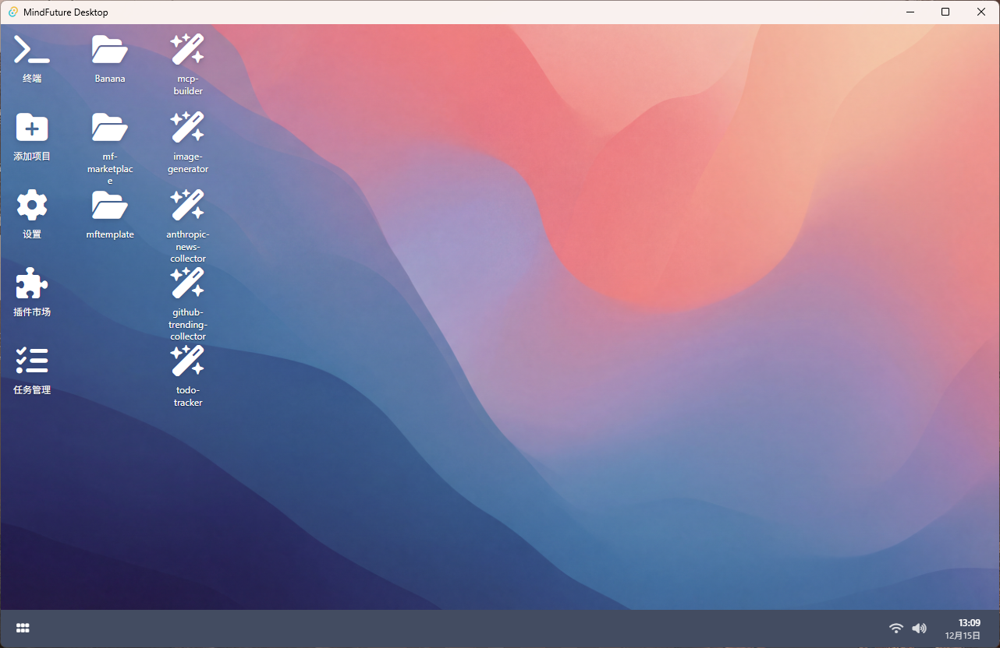
</p>

## 快速开始

### 一键安装环境

- 当用户已经安装了claude时，看不到该界面  

- **安装git** - 如果当前没有安装过git，建议提前安装

<p align="center">
  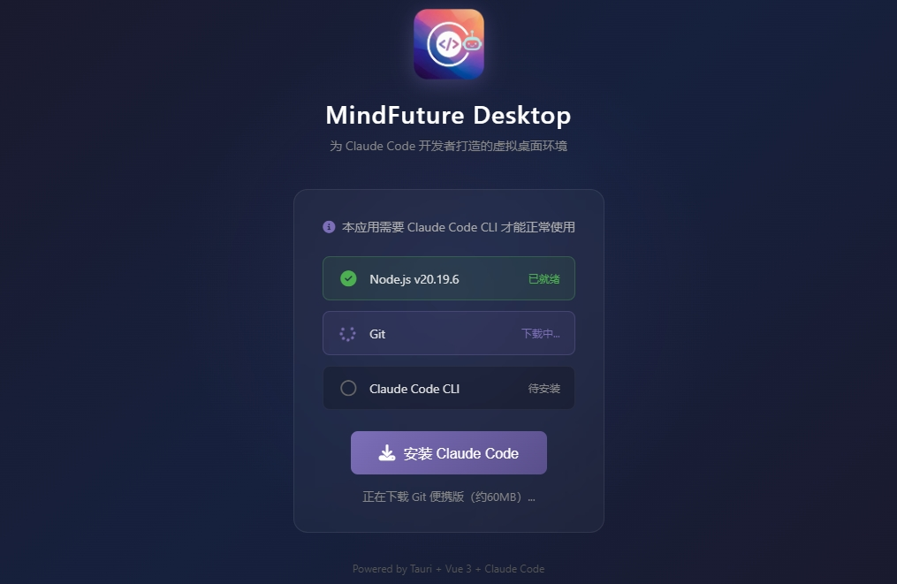
</p>

- **安装claude** - 最后安装claude环境

<p align="center">
  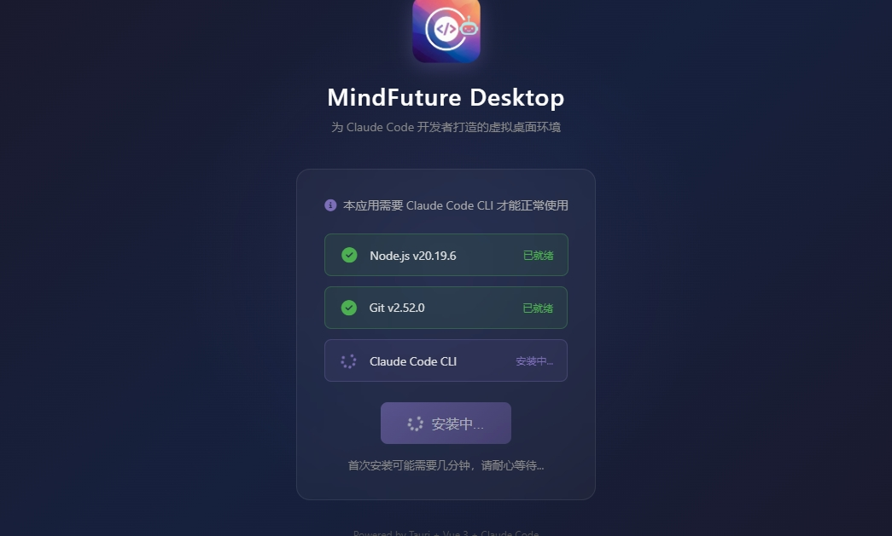
</p>

### 配置环境变量

- **点击设置** - 在设置界面中，你应该能看到环境变量标签

<p align="center">
  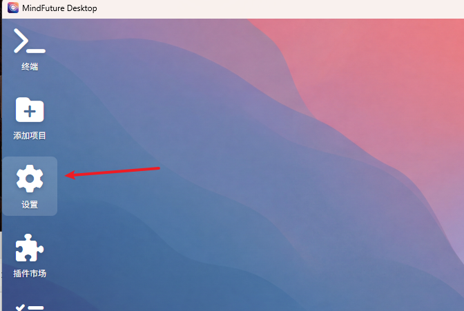
</p>

- **配置环境变量** - 在设置界面中，你应该能看到环境变量标签

<p align="center">
  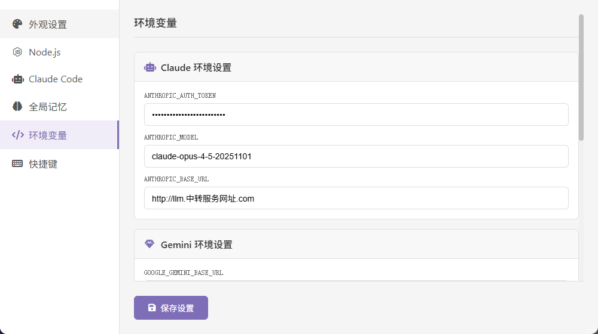
</p>

- **ANTHROPIC_BASE_URL** - 访问LLM服务的URL地址
- **ANTHROPIC_AUTH_TOKEN** - LLM服务的API Key（服务商提供或者注册申请）
- **ANTHROPIC_MODEL:** - 按需选择模型（服务商提供模型名）

#### 推荐LLM服务商

- **豆包方舟Coding** - [火山方舟大模型服务平台](https://www.volcengine.com/docs/82379/1928261?lang=zh)
- **Mooton LLM** - [mooton 内部大模型平台](https://moonton.feishu.cn/wiki/LMjOweoSRid5nmk5RoFc062nntZ)
- **Claude Code中转站** - [大陆地区专用](https://awesome-cc.com/)

### 测试添加项目并运行

- **添加工作目录** - 选择你希望AI工作的目录（比如源代码所在目录，文档所在目录）

<p align="center">
  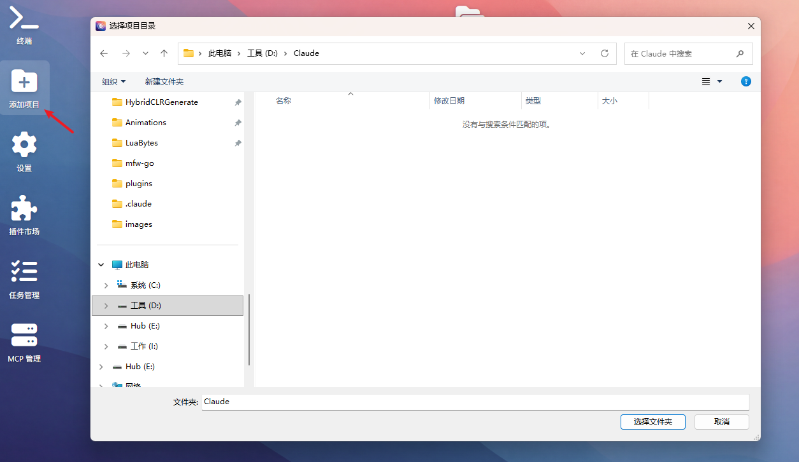
</p>

- **生成工作目录图标** - 工作目录会生成在桌面上，可以点击测试
<p align="center">
  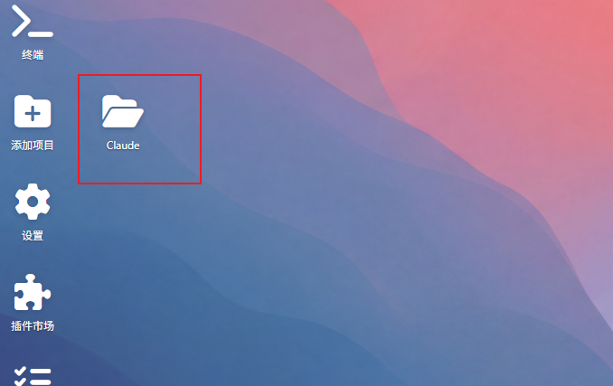
</p>

<p align="center">
  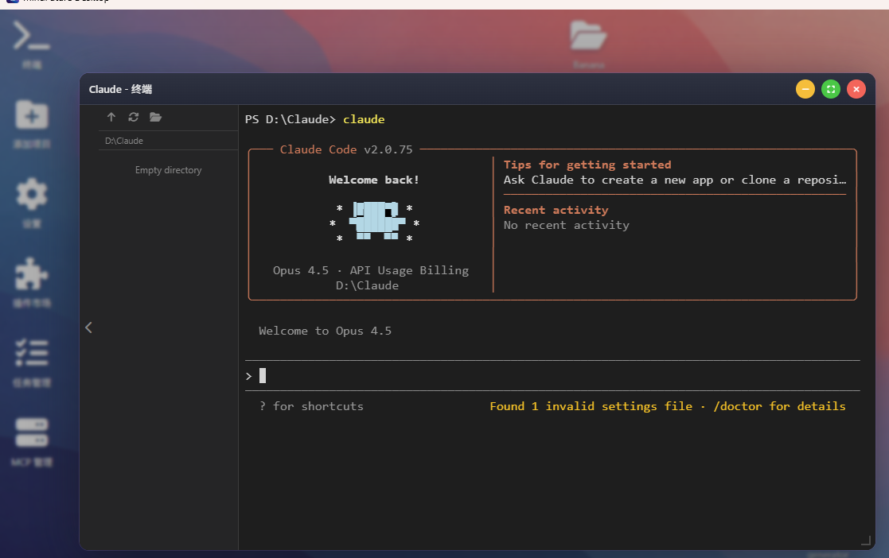
</p>

## 功能介绍

- **插件管理** - 图形化的claude code插件管理功能

<p align="center">
  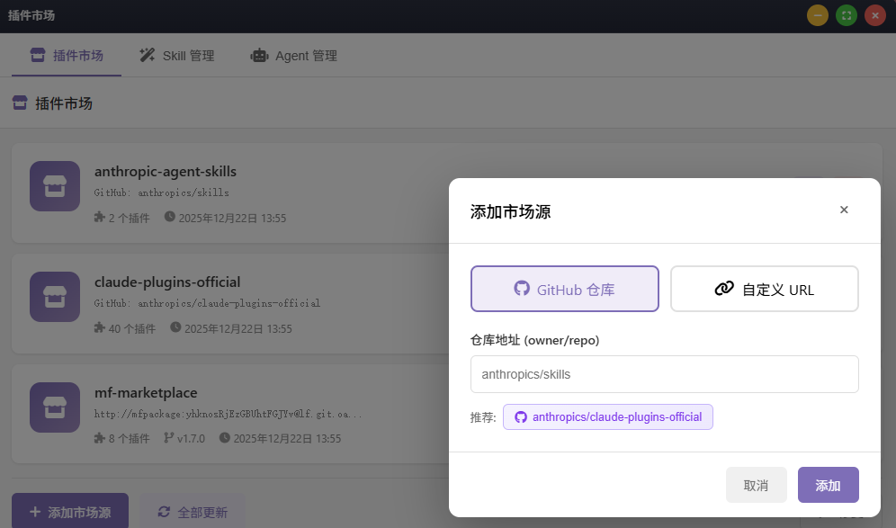
</p>

- **技能管理** - 图形化的技能管理功能 —— 支持快捷使用（快捷方式快速调用技能）

<p align="center">
  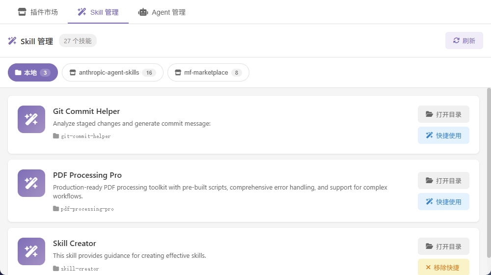
</p>

- **agent管理** - 图形化的agent管理功能

<p align="center">
  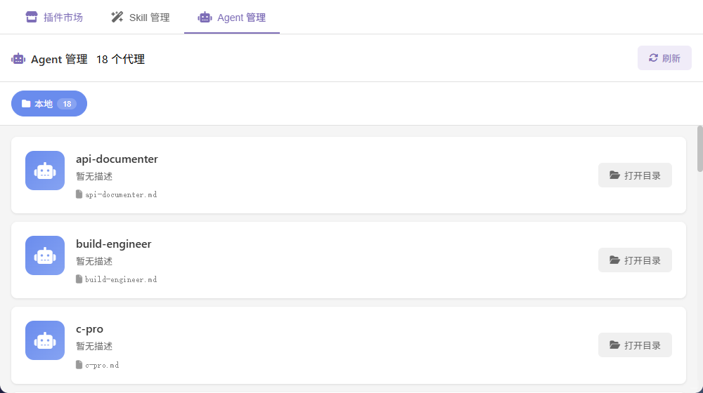
</p>

- **mcp管理** - 图形化的mcp管理功能

<p align="center">
  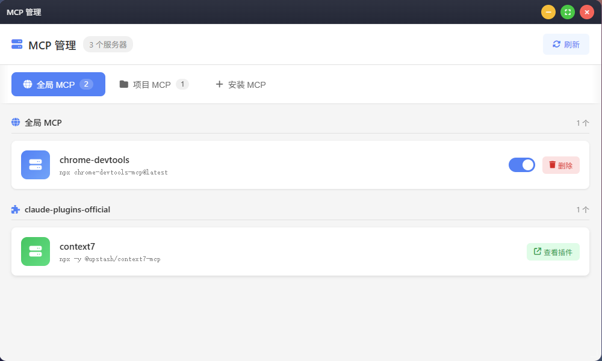
</p>

<p align="center">
  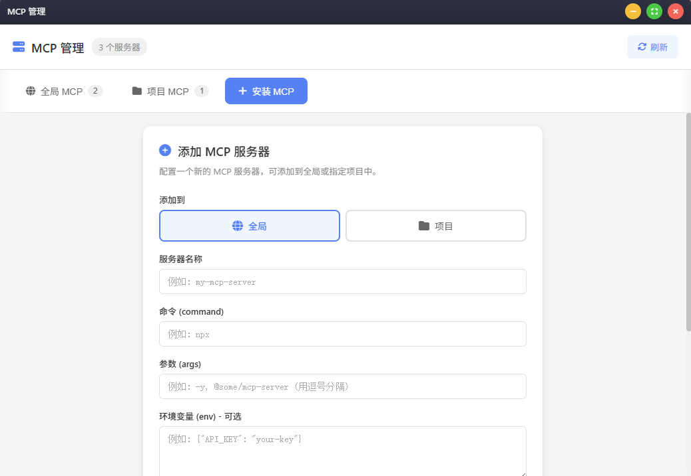
</p>

- **右键菜单** - 继续对话/完全授权/初始化项目/重新开始等快捷功能

<p align="center">
  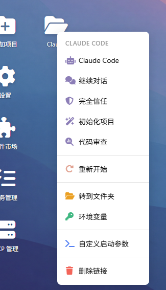
</p>

- **右键菜单** - 独立环境变量  —— 每个工程使用不同的模型

<p align="center">
  
</p>

- **右键菜单** - 删除历史文件重新开始，大遗忘术

<p align="center">
  
</p>


- **右键菜单** - 自定义启动参数

<p align="center">
  
</p>

## 功能特性

### 桌面环境
- **图标拖拽** - 自由拖拽移动图标，自动吸附网格对齐
- **窗口管理** - 支持拖拽移动、边角缩放、最小化、最大化、关闭

### 集成终端

- **完整 PTY 支持** - 使用 Windows ConPTY 的完整伪终端实现
- **Claude Code 就绪** - 可直接运行 `claude` 命令
- **自定义工作目录** - 支持在指定项目文件夹中启动终端

### 项目管理

- **项目链接** - 为项目文件夹创建桌面快捷方式
- **快速启动** - 双击图标在项目目录中打开终端
- **Claude 命令菜单** - 右键快速访问：
  - `claude` - 启动 Claude Code
  - `claude -c` - 继续上次对话
  - `claude /init` - 初始化项目
  - `claude /review` - 代码审查
- **重新开始** - 清除项目的所有 Claude 上下文和历史记录

### 插件市场
- **GitHub 集成** - 从 GitHub 仓库获取插件列表
- **技能快捷方式** - 将 Claude 技能添加到桌面
- **多源支持** - 支持配置多个插件市场源
- **Skill 管理** - 浏览和管理本地及插件技能
- **Agent 管理** - 浏览和管理本地及插件代理

> 详细功能说明请参阅 [插件市场使用指南](docs/plugin-market.md)

### MCP 管理
- **全局 MCP** - 查看和管理全局 MCP 服务器配置
- **项目 MCP** - 管理特定项目的 MCP 服务器
- **插件 MCP** - 查看来自插件的 MCP 服务器
- **安装 MCP** - 添加新的 MCP 服务器到全局或项目

> 详细功能说明请参阅 [MCP 管理指南](docs/mcp-manager.md)

### 设置面板
- **外观设置** - 自定义桌面壁纸
- **Node.js 环境** - 管理内嵌 Node.js 和一键安装 Claude Code
- **环境变量** - 配置 Claude/Gemini/Codex 环境变量
- **快捷键** - 查看可用快捷键列表

> 详细功能说明请参阅 [设置指南](docs/settings.md)

### 内嵌 Node.js
- **零依赖安装** - 内嵌 Node.js v20.x LTS，无需单独安装
- **首次自动释放** - 应用启动时自动释放到用户目录
- **一键安装 Claude Code** - 通过设置面板一键安装 Claude Code CLI
- **终端自动配置** - Node.js 路径自动注入终端 PATH

### 首次启动引导
- **自动检测** - 启动时自动检测 Claude Code 安装状态
- **引导式安装** - 未安装时显示全屏引导界面，一键完成安装
- **环境自动配置** - 自动释放 Node.js 并安装 Claude Code CLI
- **无缝体验** - 安装完成后自动进入桌面环境

### 其他功能
- **文件管理器** - 基础文件浏览功能
- **任务管理器** - 查看系统任务
- **任务栏** - 显示时间和已打开的窗口列表

## 界面截图

| 桌面视图 | 终端窗口 | 插件市场 |
|:---:|:---:|:---:|
| 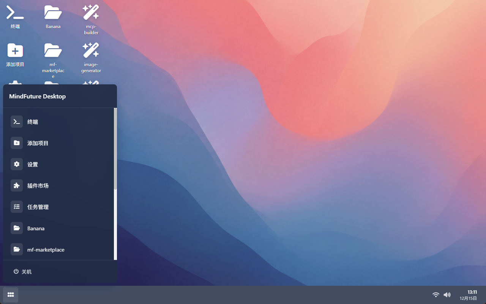 | 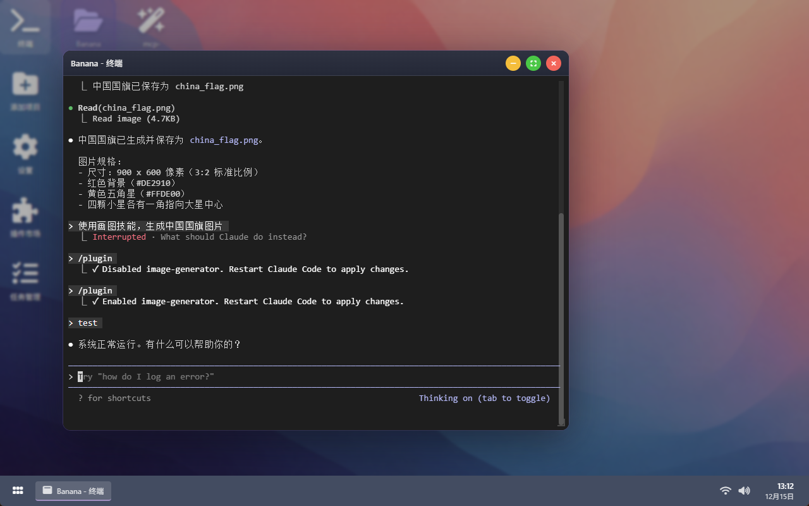 | 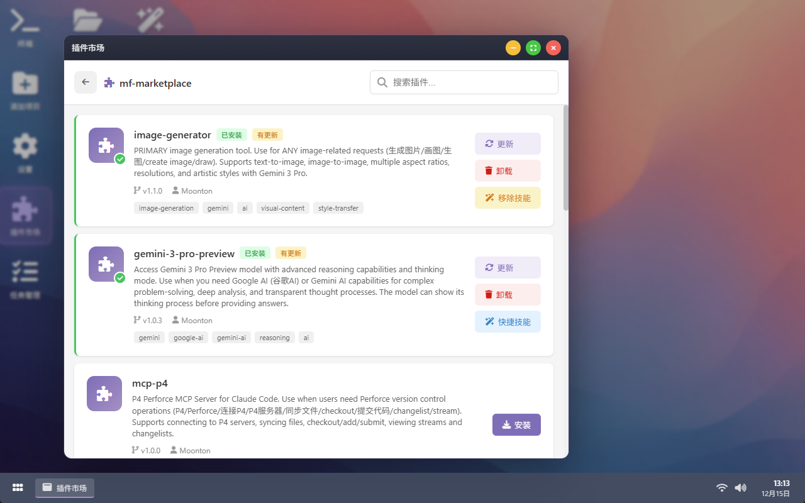 |

| 右键菜单 | 设置面板 | 窗口管理 |
|:---:|:---:|:---:|
| 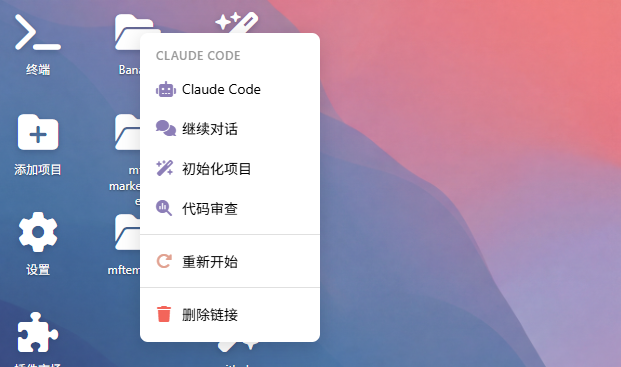 |  | 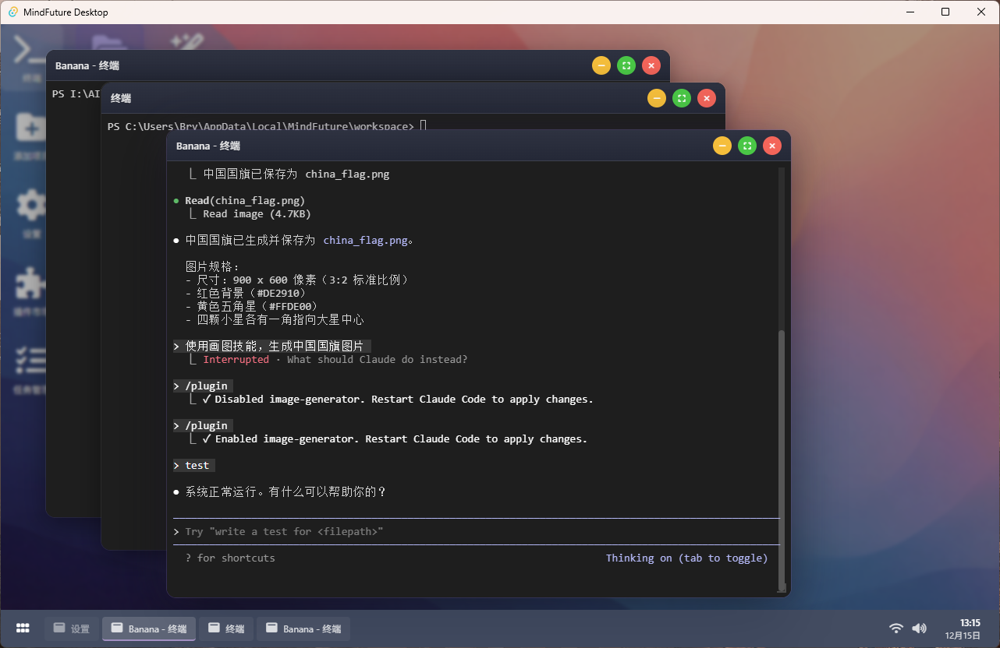 |

## 安装说明

### 下载安装

从 [Releases](http://lf.git.oa.mt/mfpackage/vibecoding/mindfuturedesktop/-/tree/master/src-tauri/target/release/bundle) 页面下载最新版本：

- **NSIS 安装程序**: `MindFuture Desktop_1.0.0_x64-setup.exe`（推荐）
- **MSI 安装包**: `MindFuture Desktop_1.0.0_x64_en-US.msi`
- **便携版**: `app.exe`

### 系统要求

- **操作系统**: Windows 10/11 (x64)
- **内存**: 最低 4GB
- **磁盘空间**: 200MB 可用空间

### 前置条件

- 有效的 Anthropic API 密钥（用于 Claude Code）

> **注意**: Node.js 和 Claude Code CLI 已内嵌到应用中，无需单独安装。首次启动时会自动释放 Node.js，可通过设置面板一键安装 Claude Code。

## 使用指南

### 快速开始

1. **启动应用程序** - 首次启动会显示引导界面
2. **安装 Claude Code** - 点击引导界面的「安装 Claude Code」按钮（仅首次需要）
3. **添加项目**: 右键桌面 → 添加项目链接 → 选择文件夹
4. **打开终端**: 双击项目图标
5. **运行 Claude**: 右键项目图标 → 选择 Claude 命令

### 快捷键

| 快捷键 | 功能 |
|--------|------|
| `Alt + Tab` | 切换窗口 |
| `Ctrl + C` | 复制选中文本（终端） |
| `Ctrl + V` | 粘贴文本（终端） |
| `Ctrl + Shift + C` | 复制（备选） |
| `Ctrl + Shift + V` | 粘贴（备选） |

### 终端功能

- **复制**: 选中文本后按 `Ctrl+C`
- **粘贴**: 按 `Ctrl+V` 从剪贴板粘贴
- **滚动**: 使用鼠标滚轮或滚动条
- **最小化/恢复**: 窗口状态完整保留

## 技术栈

| 层级 | 技术 |
|------|------|
| 前端框架 | Vue 3 + TypeScript |
| 状态管理 | Pinia |
| 样式 | Less + CSS Variables |
| 后端 | Rust + Tauri v2 |
| 终端 | xterm.js + Windows ConPTY |
| 构建工具 | Vite |

## 开发指南

### 环境要求

- [Node.js](https://nodejs.org/) (v18+)
- [Rust](https://www.rust-lang.org/) (最新稳定版)
- [Tauri CLI](https://tauri.app/) v2

### 安装步骤

```bash
# 克隆仓库
git clone https://github.com/yourusername/MindFutureDesktop.git
cd MindFutureDesktop

# 安装依赖
npm install

# 开发模式运行
npm run dev

# 生产构建
npm run build
```

### 可用脚本

| 命令 | 说明 |
|------|------|
| `npm run dev` | 启动开发服务器（热重载） |
| `npm run build` | 构建生产版本 |
| `npm run build:frontend` | 仅构建前端 |
| `npm run typecheck` | 运行 TypeScript 类型检查 |
| `npm run lint` | 运行 ESLint 检查 |
| `npm run format` | 使用 Prettier 格式化代码 |

### 项目结构

```
MindFutureDesktop/
├── src/                          # 前端源码
│   ├── components/               # Vue 组件
│   │   ├── Desktop.vue          # 桌面区域
│   │   ├── DesktopIcon.vue      # 桌面图标
│   │   ├── Window.vue           # 窗口组件
│   │   ├── WindowManager.vue    # 窗口管理器
│   │   ├── Taskbar.vue          # 任务栏
│   │   ├── Terminal.vue         # 终端模拟器
│   │   ├── FileManager.vue      # 文件管理器
│   │   ├── Settings.vue         # 设置面板
│   │   ├── PluginMarket.vue     # 插件市场
│   │   ├── McpManager.vue       # MCP 管理器
│   │   ├── TaskManager.vue      # 任务管理器
│   │   └── SetupGuide.vue       # 首次启动引导
│   ├── stores/                   # Pinia 状态存储
│   ├── composables/              # Vue 组合式函数
│   ├── types/                    # TypeScript 类型定义
│   └── assets/                   # 静态资源
├── src-tauri/                    # Rust 后端
│   └── src/
│       ├── main.rs              # Tauri 入口
│       ├── lib.rs               # 应用配置
│       ├── pty.rs               # PTY 终端处理
│       ├── app_paths.rs         # 路径管理
│       ├── marketplace.rs       # GitHub API 集成
│       ├── mcp.rs               # MCP 服务器管理
│       └── nodejs.rs            # Node.js/Claude Code 管理
├── public/                       # 公共静态文件
└── dist/                         # 构建输出
```

## 开发计划

- [ ] 自定义主题色
- [ ] 更多壁纸选择
- [ ] 多语言支持 (i18n)
- [ ] Linux/macOS 支持
- [ ] 设置云同步
- [ ] 更多 Claude 集成功能

## 参与贡献

欢迎提交 Pull Request！

1. Fork 本仓库
2. 创建特性分支 (`git checkout -b feature/AmazingFeature`)
3. 提交更改 (`git commit -m 'Add some AmazingFeature'`)
4. 推送到分支 (`git push origin feature/AmazingFeature`)
5. 创建 Pull Request

## 许可证

本项目采用 MIT 许可证 - 详见 [LICENSE](LICENSE) 文件。

## 致谢

- [Tauri](https://tauri.app/) - 优秀的跨平台框架
- [Vue.js](https://vuejs.org/) - 响应式前端框架
- [xterm.js](https://xtermjs.org/) - 终端模拟器
- [Anthropic](https://anthropic.com/) - Claude 和 Claude Code

---

<p align="center">
  <strong>MindFuture Desktop</strong> - 为 Claude Code 开发者打造的虚拟桌面环境
</p>

<p align="center">
  用 ❤️ 为 Claude Code 社区打造
</p>
